<p align="center">
  
</p>


#  HAZIRLIK ÇALIŞMASI


❗❗ 
```yaml
   to: Destek@beratarikan.com.tr
```

## SANALLAŞTIRMA ve İŞLETİM SİSTEMİ 

1. Sanalaştırma için 2 makina kurulumu gerçekleştirdim

1. Makine : 
     Ubuntu 22.04
     8 GB RAM
     6 Core
     150 GB DİSK
     IP: 109.122.196.167
2. Makine 
      RockyLinux
      8 GB RAM
      6 Core
      100 GB DİSK
      IP: 109.122.196.164

Kurulumları Vcenter Tarafından yaptım. 

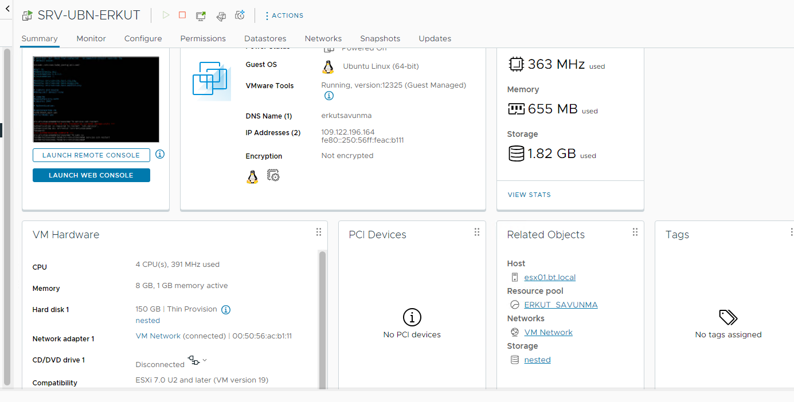

### ADIMLAR


   1. 2 makinede de `LinuxAdmin` kullanıcısı oluşturun ve parolasını `SysAdmin99` olarak belirleyin.
   ```yaml
        RockyLinux için Kullanıcı oluşturuldu.
   ```


   2. 2 makinede de `LinuxAdmin` kullanıcısına **şifresiz olarak root** yetkisi verin. (Yani sudo komutunu çalıştırırken şifre sormasın.)
       ```yaml
        Root Yetkisi verildi sudo su yazınca veri bilgileri şifresiz olarak devam etmektedir. 
        ```
        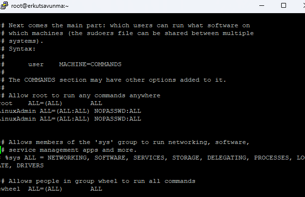


   
   3. Aşağıdaki çıktıyı veren scripti(tarih-bas.sh) yazın ve çalıştırın.
   
   ```bash
   Script i çalıştırdığımda;
   
   #Output
   Adınız Soyadınız
   Tarih: 2024-01-12 (Script çalıştığı tarih)
   Saat: 22:15 (Script çalıştığı saat)
   ```
 ```yaml
        Ubuntu 22.04 sunucusuna script yazıldı script. ek'te sunulmuştur. 
```
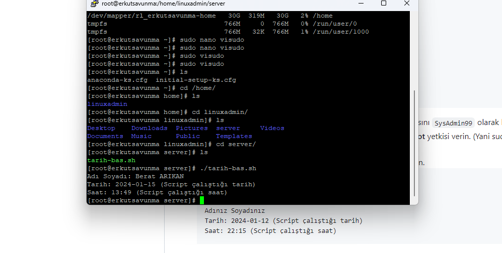
  
   4. **tarih-bas.sh** scrpitinin sahipliğini `root` olarak ata ve izinlerini `777` olarak değiştirin.
```yaml
        tarih ve root izinleri verildi yetkisi 777 olarak verildi
```
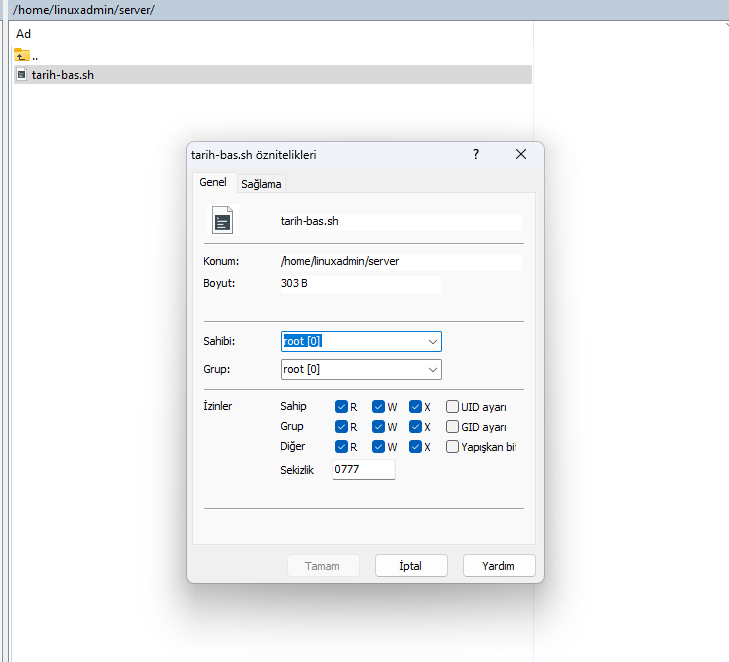

   5. UFW/Firewalld servisini komple durdurun. (Sunucu yeniden başladığında çalışmasın.)
```yaml
        Firewall yetkileri disable olarak kaptıldı - sunucu yeniden başlarken durduruldu.
```
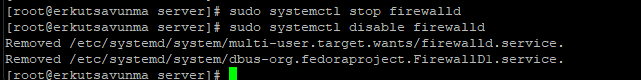

   6. Sistem log dosyası içerisinde `ERROR,error,eRRor` geçen kelimleri filtrele ve `LinuxAdmin Home Dizini` içerisinde `error.logs` dosyasına yazdırın.
```yaml
       Eror logları tamamen linuxadmin home dosyasında error.logs dosyasına gönderildi.
```
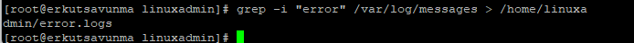
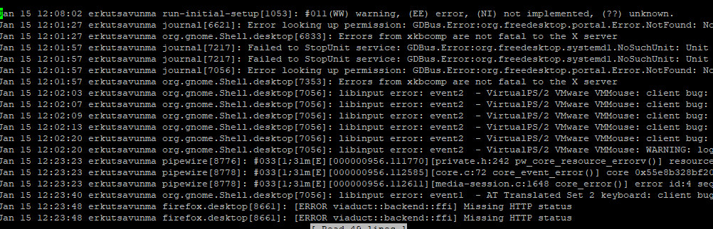
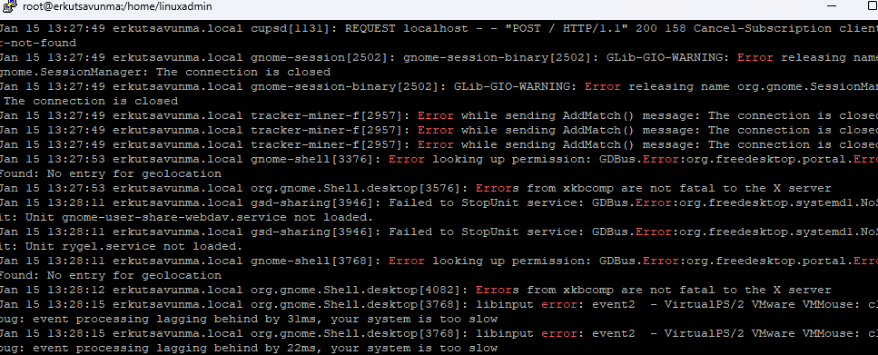


   7. Ubuntu 22.04 makinesinde IP netplan ile verilmiştir. Bu konfigürasyona `8.8.8.8` ve `8.8.4.4 DNS` kayıtlarını ekleyin.
```yaml
       Dns kayıtlarını türktelekom ve google dns kayıtları ekledim.
```
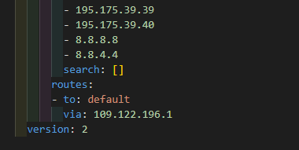


### DOCKER ve KUBERNETES

1. Ubuntu 22.04 makinesine `APT repoları kullanılarak`, son sürüm `docker` ve `docker-compose`  kurun. 
```yaml
       docker ve docker-compose kurulum yaptım.
```
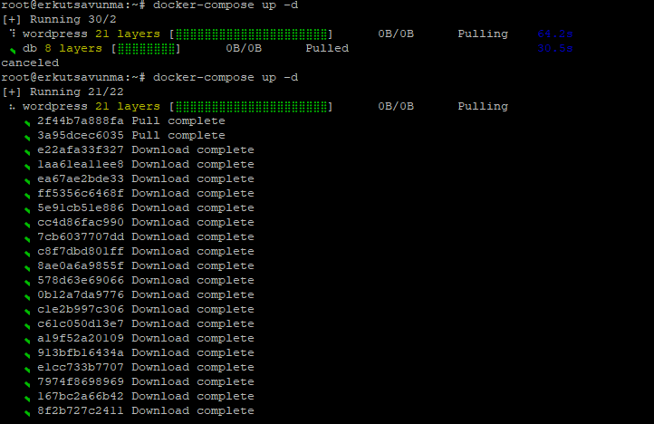

   1. `docker` ve `docker-compose` versiyonlarını ekrana bastırın.
```yaml
       docker ve docker-compose verison.
```


   2. `busybox:1.35.0` sürümünü docker ile çekin.
```yaml
       busybox:1.35.0 kurulum yaptım.
```


   3. Wordress + Veritabanı (MySQL/MariaDB) ayağa kaldıracak bir `docker-compose-wordpress.yaml` oluşturun.
```yaml
       docker-compose wordpress kurlumu yaptım.
```

   4. Wordpress servisinin loglarını ekrana bastırın.
```yaml
       Wordpress servisi logları ekrana bastırdım.
```
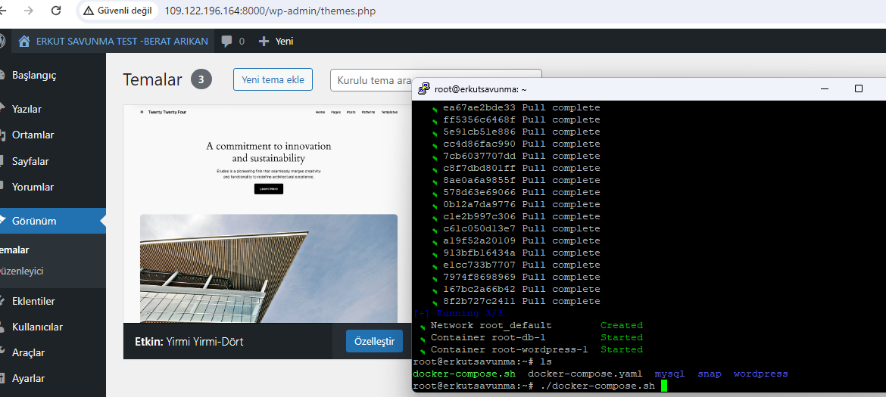
   5. Çekilen imajların bilgilerini ekrana bastırın.
```yaml
   Çekilen imajların bilgileri ekrana bastırma.
```


   6. Veritabanı konteynırının içerisine girip, wordpress table larını listeleyin.


   7. `docker-compose-wordpress.yaml`  ile ayağa kaldırdığınız servisleri durdurun ve Wordpress + DB imajlarını sistemden silen scripti yazınız.

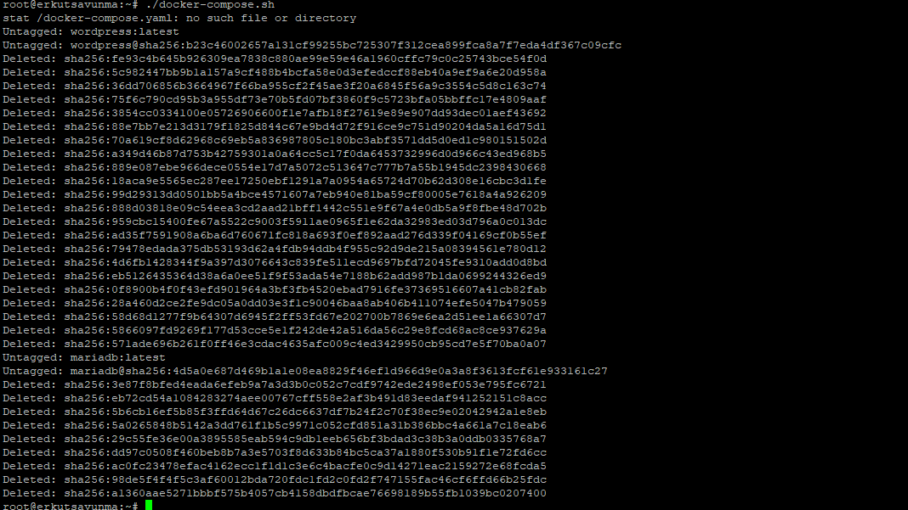
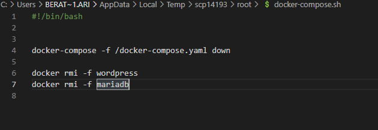

(?) 2. RockyLinux makinesine [`k3s Kubernetes dağıtımını`](https://k3s.io/) kurunuz.
   1. Kubernetes node un özelliklerini gösterin.
   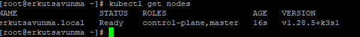

   2. Wordpress+DB'yi kubernetes ortamına deploy(çalışır hale) edin.

   3. http://IP_ADRESINIZ:32222  üzerinden Wordpress e giriş yapabileyim.
      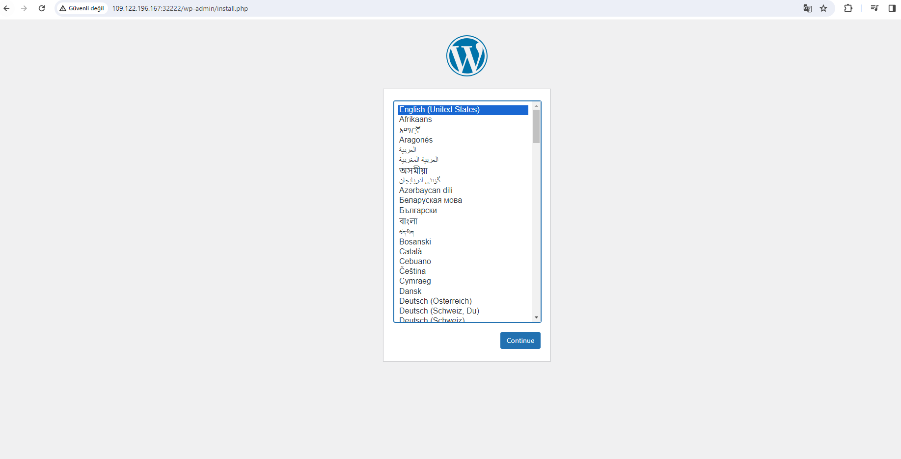

   4. Wordpress loglarını ekrana bastırın.
         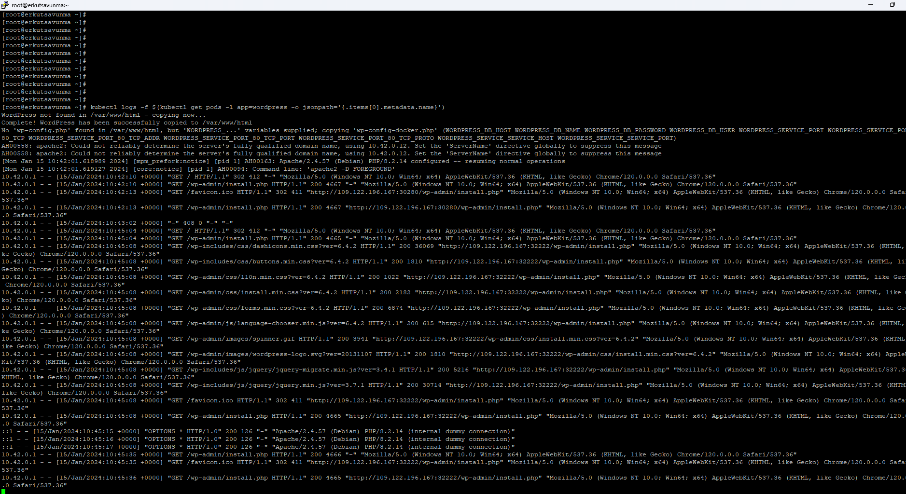

   5. Kubernetes Dashboard ı aktif edip, pod durumlarını gösterin. (?) k9s/Lens ile de gösterebilirsiniz.
         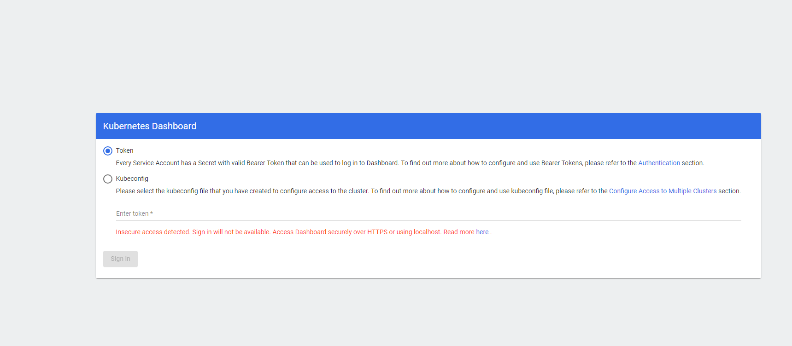


Esen kalın ...